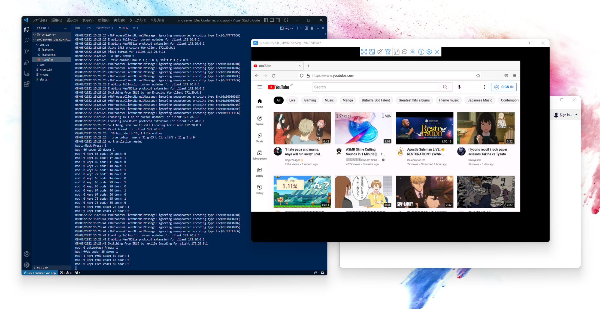

#### 自作VNC Server



#### 始め方

##### Docker構築
---
```
$cd vnc-docker
$docker-compose build
$docker-compose up -d
```

##### Docker shell
---
```
$cd vnc_src
$make

$cd ..
$xterm &
$./myvnc
```

##### VNCクライアント
---
```
127.0.0.1:5900
```

#### 参考資料

[LibVNCServer/LibVNCClient](http://libvnc.github.io/)

[XTEST Extension Library - Coocan](http://t-sato.in.coocan.jp/x/xtestlib-j.html)